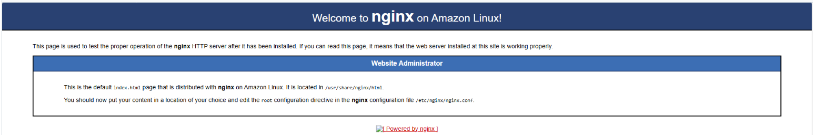

<h1>Nginx Web Application</h1>

<h2> Overview </h2>

This project involves deploying a robust nginx web application using Infrastructure as Code principles. The architecture comprises a Virtual Private Cloud (VPC) with two strategically placed subnets in different availability zones, an internet gateway facilitating external communication, and an Application Load Balancer (ALB) for efficient traffic distribution.

The technologies utilised in this project include Terraform, AWS, and Nginx. The project incorporates two essential modules: one for configuring the EC2 instance (the host for Nginx) and another for establishing the VPC housing the instance and other crucial components. Best practices for security, scalability, and maintainability were followed throughout the project.

<h2> Prerequisites </h2>

🛠 Prerequisites
Before starting on this project, ensure you have the following installed on your computer:

- ✅ An AWS Account - [Create An Account Here](https://aws.amazon.com/free)
- ✅ Terraform - [Download & Install](https://developer.hashicorp.com/terraform/tutorials/aws-get-started/install-cli)
- ✅ Git - [Download & Install](https://git-scm.com/downloads)

<h2> Project Directory Structure </h2>

Here is a view of the project's directory structure:

```hcl
environments/
├── dev/
│   ├── main.tf
│   ├── terraform.tfvars
│   ├── variables.tf
│   └── versions.tf
├── production/
│   ├── main.tf
│   ├── terraform.tfvars
│   ├── variables.tf
│   └── versions.tf
└── staging/
    ├── main.tf
    ├── terraform.tfvars
    ├── variables.tf
    └── versions.tf
modules/
├── EC2/
│   ├── main.tf
│   ├── outputs.tf
│   └── variables.tf
└── VPC/
    ├── main.tf
    ├── output.tf
    └── variables.tf
tests/
├── vpc_test.go
├── webapp_test.go
└── examples/
    ├── vpc/
    │   ├── main.tf
    │   ├── output.tf
    │   └── variables.tf
    └── webapp/
        ├── main.tf
        ├── outputs.tf
        └── variables.tf
```

The project is organised into three main directories:
- environments: Contains configurations for development, staging, and production environments
- modules: Houses reusable Terraform modules for EC2 and VPC infrastructure
- tests: Contains Terratest files for infrastructure testing using Golang

<h2> Step 1: Setting up the Infrastructure </h2>

To begin deploying the infrastructure, follow these steps:

1. Clone the repository and navigate to your desired environment directory:
```hcl
cd environments/<environment>  # dev, staging, or production
```

2. Initialise Terraform:
```hcl
terraform init
```

3. Review the planned changes:
```hcl
terraform plan
```

4. Apply the infrastructure:
```hcl
terraform apply
```

</h2> Accessing web application </h2>

- You should be able to access the instance in either availability zone through the Application Load Balancer's DNS name:


- Once you do, you will be presented with the following web page:



Well done! You have successfully the infrastructure, and have a working web server.


<h2> Step 2: Testing the Infrastructure </h2>

The project includes comprehensive Terratest files to validate the infrastructure:

```hcl
cd tests
go test -v ./...
```

The tests verify:
- VPC Configuration (vpc_test.go):
  - Public subnet counts
  - CIDR block values
  - Resource deployment in the specified region
- Web Application Setup (webapp_test.go):
  - EC2 instance public IP validity
  - HTTP accessibility on port 80

<h2> Step 3: Environment Management </h2>

This project supports three environments:
- Development (dev): For development and testing (no ALB)
- Staging: Pre-production environment with full infrastructure
- Production: Live environment with full infrastructure

Each environment contains:
- main.tf: Defines the infrastructure structure
- terraform.tfvars: Environment-specific variables
- variables.tf: Default variable definitions
- versions.tf: Terraform and AWS version specifications

<h2> Step 4: CI/CD Pipeline </h2>

The project includes a CI/CD pipeline that automates:
1. Infrastructure Planning
2. Infrastructure Deployment
3. Infrastructure Testing
4. Infrastructure Destruction (when needed)

The pipeline uses an S3 remote backend to maintain state consistency across stages.

<h2> Step 5: Cleaning Up </h2>

To avoid unnecessary AWS charges, destroy the infrastructure when no longer needed:

```hcl
terraform destroy -auto-approve
```